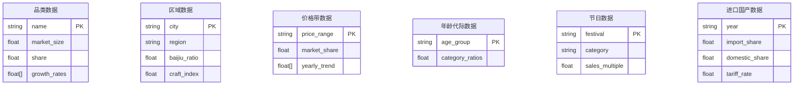

## 1. 架构设计

```mermaid
graph TD
    "A[浏览器客户端]" --> "B[Vue3 + Naive UI 前端]"
    "B" --> "C[ECharts 图表引擎]"
    "B" --> "D[HTTP API 请求]"
    "D" --> "E[Flask Python 后端]"
    "E" --> "F[pandas 数据处理层]"
    "F" --> "G[本地模拟数据 JSON/CSV]"
    "E" --> "H[CORS 跨域支持]"
    "B" --> "I[Pinia 状态管理]"
```

## 2. 技术描述

- **前端框架**：Vue 3.4+ + TypeScript 5+ + Vite 5
- **UI组件库**：Naive UI 2.38+
- **图表库**：Apache ECharts 5.5+（专业数据可视化）
- **状态管理**：Pinia 2.1+
- **HTTP客户端**：Axios 1.6+
- **样式方案**：Tailwind CSS 3.4+ + SCSS
- **后端框架**：Flask 3.0+（Python 3.11+）
- **数据处理**：pandas 2.1+ + numpy 1.26+
- **跨域支持**：Flask-CORS 4.0+
- **数据源**：本地生成的模拟数据（JSON格式），模拟真实中国酒类市场数据特征

## 3. 项目目录结构

```
label-115/
├── frontend/                    # 前端项目
│   ├── src/
│   │   ├── components/          # 可复用组件
│   │   │   ├── charts/          # 图表组件
│   │   │   │   ├── CategoryPieChart.vue
│   │   │   │   ├── GrowthTrendChart.vue
│   │   │   │   ├── RegionRadarChart.vue
│   │   │   │   ├── PriceRangeChart.vue
│   │   │   │   ├── AgeGroupChart.vue
│   │   │   │   ├── FestivalEffectChart.vue
│   │   │   │   └── ImportCompareChart.vue
│   │   │   ├── layout/          # 布局组件
│   │   │   │   ├── DashboardHeader.vue
│   │   │   │   ├── FilterBar.vue
│   │   │   │   └── StatCard.vue
│   │   │   └── modules/         # 业务模块组件
│   │   │       ├── CategoryModule.vue
│   │   │       ├── RegionModule.vue
│   │   │       ├── PriceModule.vue
│   │   │       ├── AgeModule.vue
│   │   │       ├── FestivalModule.vue
│   │   │       └── ImportModule.vue
│   │   ├── composables/         # Vue组合式函数
│   │   │   └── useDashboardData.ts
│   │   ├── stores/              # Pinia状态管理
│   │   │   └── dashboard.ts
│   │   ├── api/                 # API接口封装
│   │   │   └── index.ts
│   │   ├── types/               # TypeScript类型定义
│   │   │   └── index.ts
│   │   ├── utils/               # 工具函数
│   │   │   └── chartOptions.ts
│   │   ├── App.vue
│   │   ├── main.ts
│   │   └── style.css
│   ├── index.html
│   ├── package.json
│   ├── vite.config.ts
│   ├── tsconfig.json
│   └── tailwind.config.js
├── backend/                     # 后端项目
│   ├── app.py                   # Flask主应用入口
│   ├── data/                    # 数据目录
│   │   ├── generator.py         # 模拟数据生成脚本
│   │   └── dataset.json         # 生成的数据集
│   ├── services/                # 业务逻辑层
│   │   └── data_service.py      # 数据处理服务
│   ├── routes/                  # 路由层
│   │   └── api.py               # API路由定义
│   ├── requirements.txt         # Python依赖
│   └── config.py                # 配置文件
└── README.md
```

## 4. 路由定义

| 前端路由 | 用途 |
|----------|------|
| / | 数据看板主页面，展示所有分析模块 |

## 5. API定义

### 5.1 接口总览

| API路径 | 方法 | 用途 |
|---------|------|------|
| /api/overview | GET | 获取数据概览统计指标 |
| /api/category | GET | 获取品类结构分析数据 |
| /api/region | GET | 获取区域消费偏好数据 |
| /api/price-range | GET | 获取白酒价格带分析数据 |
| /api/age-group | GET | 获取年龄代际消费差异数据 |
| /api/festival | GET | 获取节日消费效应数据 |
| /api/import-compare | GET | 获取进口与国产对比数据 |

### 5.2 TypeScript类型定义

```typescript
// 品类数据
interface CategoryData {
  name: string;
  marketSize: number;      // 市场规模（亿元）
  share: number;           // 市场份额（%）
  growth: number[];        // 近5年增速
  colors: string;
}

// 区域数据
interface RegionData {
  city: string;
  region: string;
  baijiu: number;          // 白酒消费占比
  beer: number;            // 啤酒
  craftBeer: number;       // 精酿啤酒
  wine: number;            // 红酒
  huangjiu: number;        // 黄酒
  whiskey: number;         // 威士忌
  craftIndex: number;      // 精酿消费指数
}

// 价格带数据
interface PriceRangeData {
  range: string;
  share: number;
  trend: number[];         // 历年份额变化
}

// 年龄代际数据
interface AgeGroupData {
  ageGroup: string;
  baijiu: number;
  beer: number;
  craftBeer: number;
  wine: number;
  sparkling: number;
  huangjiu: number;
  whiskey: number;
}

// 节日数据
interface FestivalData {
  festival: string;
  category: string;
  salesMultiple: number;   // 相对平日倍数
  highEndRatio: number;    // 高端酒占比
}

// 进口国产对比
interface ImportCompareData {
  year: string;
  importWineShare: number;
  domesticWineShare: number;
  importWhiskeyShare: number;
  domesticWhiskeyShare: number;
  tariffRate: number;      // 关税率（%）
}
```

### 5.3 响应格式

所有接口统一响应格式：
```json
{
  "code": 0,
  "message": "success",
  "data": { ... }
}
```

## 6. 数据模型

### 6.1 数据模型关系



### 6.2 数据特征说明

模拟数据需体现以下真实市场特征：
- 白酒占比60%以上，年增速4-8%并逐年放缓
- 精酿啤酒年增速25%+，威士忌年增速20%+
- 东北地区白酒占比75%+
- 沿海城市红酒渗透率35%+
- 成都、重庆精酿消费指数≥120
- 30岁以下群体白酒占比<30%，30-50岁占比55%+
- 春节白酒销售倍数3-5倍
- 情人节红酒香槟消费暴增5-8倍
- 中秋送礼高端化（800元以上占比45%+）
